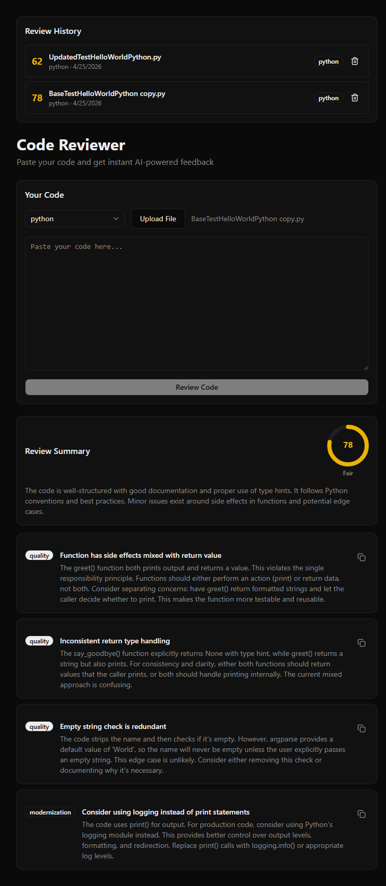

# Code Reviewer AI

An AI-powered code review tool that analyzes your code for security vulnerabilities, performance issues, modernization opportunities, and quality improvements.

Built with FastAPI, React, TypeScript, and the Anthropic Claude API.



## Features

- 🔍 Paste code or upload a file directly
- 🤖 AI-powered analysis using Claude
- 📊 Visual quality score with colour-coded ring
- 🏷️ Issues categorized by type — security, performance, modernization, quality
- 📋 One-click copy for fix suggestions
- 🕓 Review history saved locally
- 🔒 Token authentication to protect the API
- ⚡ Rate limiting — 5 requests per minute per IP
- 🛡️ Prompt injection protection

## Tech Stack

**Frontend:** React, TypeScript, Vite, Tailwind CSS, shadcn/ui

**Backend:** Python, FastAPI, Anthropic Claude API, SlowAPI

## Getting Started

### Prerequisites
- Python 3.13+
- Node.js 24+
- Anthropic API key — get one at [console.anthropic.com](https://console.anthropic.com)

### Backend

```bash
cd backend
python -m venv venv
venv\Scripts\activate
pip install fastapi uvicorn anthropic python-dotenv slowapi
```

Create a `.env.development` file in the backend folder:
~~~
ANTHROPIC_API_KEY=your_api_key_here
ANTHROPIC_MODEL=claude-haiku-4-5
API_SECRET_TOKEN=your_secret_token_here
~~~

Start the backend:
```bash
$env:ENV="development"; uvicorn main:app --reload
```

### Frontend

Create a `.env.local` file in the frontend folder:
~~~
VITE_API_SECRET_TOKEN=your_secret_token_here
VITE_API_URL=http://127.0.0.1:8000
~~~
Then:
```bash
cd frontend
npm install
npm run dev
```

Open [http://localhost:5173](http://localhost:5173)

## Supported Languages

- PHP
- JavaScript
- TypeScript
- Python
- C#

## Security

- API protected with bearer token authentication
- Rate limited to 5 requests per minute per IP
- Input capped at 10,000 characters
- Prompt injection protection via sandboxed code blocks

## License

MIT